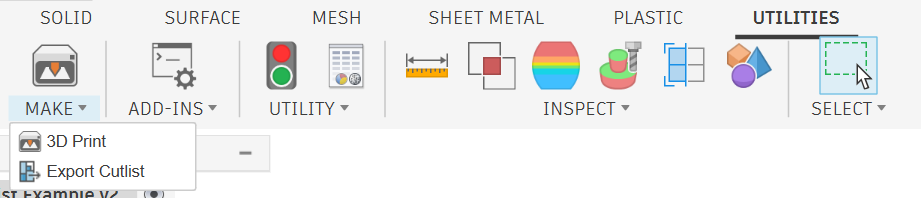
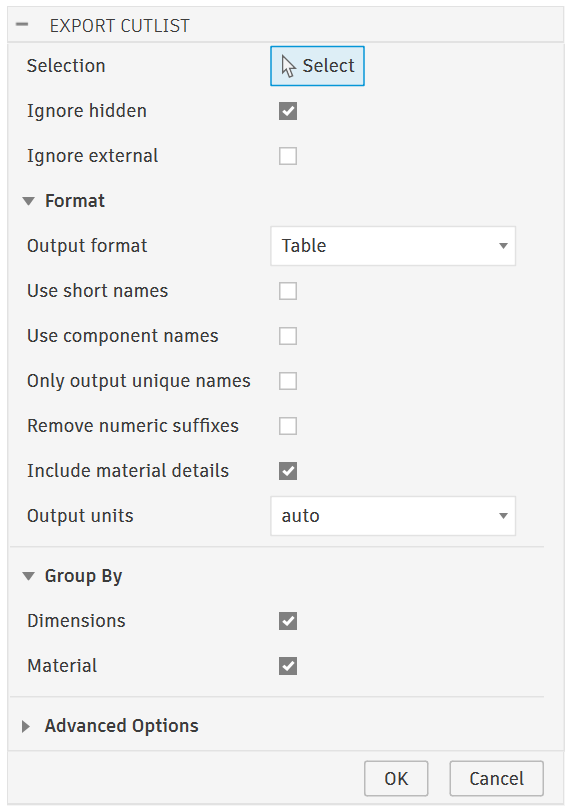
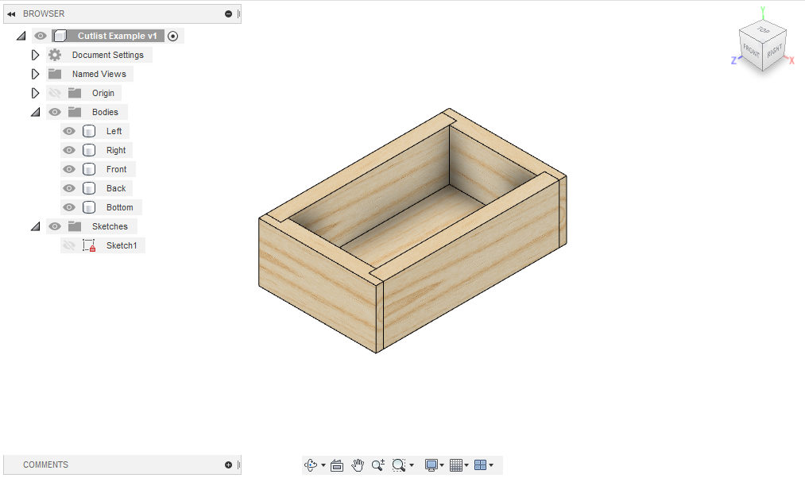

# Fusion360 Export Cutlist 

An Autodesk Fusion360 addin that can export a cut list of parts in a variety
of formats. Useful for woodworking or other crafts that mostly cut shapes out of
rectangular stock.

It's compatible with many modeling styles and does not require a specific
document structure or workflow.

## Features

- Operates on bodies, selected either directly or by selecting components
- Groups parts by matching bounding box dimensions and materials
  - The largest dimension is called `length`, the next largest `width`, and the smallest `height`
  - Accounts for [part rotation](#matching-rotation) when matching bounding boxes
  - Customize grouping conditions
- Exports to text, HTML, JSON, CSV, and more
- Additional filtering options for bodies (e.g. visibility)

## Installation

1. Download the [latest release](https://github.com/bluekeyes/Fusion360-ExportCutlist/archive/v0.5.1.zip)
2. Unzip the file on your computer
3. Start Fusion360 and open the "Scripts & Addins" dialog (Shift+S)
4. Go to the "Add-Ins" tab
5. Click the green "+" (plus) sign next to "My Add-Ins"
6. Selected the extracted folder from Step 2
7. Click the "Run" button (or restart Fusion 360) to start the add-in

The wiki also has a [detailed version of these steps with annotated screenshots](https://github.com/bluekeyes/Fusion360-ExportCutlist/wiki/Installation).

## Usage

The "Export Cutlist" command is added to the "Make" panel:



After selecting the command, a dialog appears where you can select components
and bodies and set other options:



When you are ready to export, click "OK". A file selection dialog will open
asking where to save the file. Choose a file and click "Save". A message box
will open confirming the file was saved.

## Formats

The addon can export cutlists in the following formats:

* Plain text
* JSON
* HTML
* CSV
* CSV as used by https://cutlistoptimizer.com
* TSV as used by https://cutlistevo.com

## Example Output

The cutlist for a simple box with a bottom was exported as a table, JSON, and
CSV to demonstrate the different formats.



### Table

```text
count      material       length (in)   width (in)   height (in)   names 
=========================================================================
    2   Pine                     6.00         2.00          0.50   Left  
                                                                   Right 
-------------------------------------------------------------------------
    2   Pine                     4.00         2.00          0.50   Back  
                                                                   Front 
-------------------------------------------------------------------------
    1   Plywood, Finish          6.00         3.50          0.25   Bottom
```

### JSON

```json
[
  {
    "count": 2,
    "dimensions": {
      "units": "in",
      "length": "6.00",
      "width": "2.00",
      "height": "0.50"
    },
    "material": "Pine",
    "names": [
      "Left",
      "Right"
    ]
  },
  {
    "count": 2,
    "dimensions": {
      "units": "in",
      "length": "4.00",
      "width": "2.00",
      "height": "0.50"
    },
    "material": "Pine",
    "names": [
      "Back",
      "Front"
    ]
  },
  {
    "count": 1,
    "dimensions": {
      "units": "in",
      "length": "6.00",
      "width": "3.50",
      "height": "0.25"
    },
    "material": "Plywood, Finish",
    "names": [
      "Bottom"
    ]
  }
]
```

### CSV

```csv
count,material,length (in),width (in),height (in),names
2,Pine,6.00,2.00,0.50,"Left,Right"
2,Pine,4.00,2.00,0.50,"Back,Front"
1,"Plywood, Finish",6.00,3.50,0.25,Bottom
```

## Matching Rotation

The addon uses the folowing algorithm to detect rotated parts:

1. Find the planar face with the largest perimeter
2. Find the orientation vector of the longest edge of the face
3. Rotate the body so that the normal vector of the face is aligned with the Z
   axis and the orientation vector of the longest edge is aligned with the X axis
4. Return the axis-aligned bounding box of the rotated body

This should produce correct results for most common situations in woodworking,
where almost all parts will have at least one flat face that is aligned with
one of the stock faces. 

Bodies that don't work with this algorithm (e.g. because they have no planar
faces) use the axis-aligned bounding box computed by Fusion 360. You can also
disable the rotation heuristic and always use axis-aligned boxes in the advanced
options.

## License

MIT

## Contributing

Pull requests or issues suggesting additional features or output formats are
welcome. If reporting a bug, please attach or a link to a design that
reproduces the issue.
