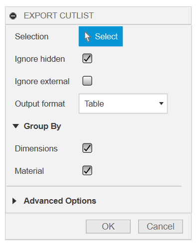

# Fusion360 Export Cutlist 

An Autodesk Fusion360 addin that can export a cut list of parts in a variety
of formats. It is meant to adapt to multiple workflows and does not require
you to structure your design in a specific way.

## Features

- Operates on bodies, selected either directly or by selecting components
- Exports to JSON, CSV, or text table
- Automatically groups parts by matching body bounding box dimensions and
  materials
  - The largest dimension is considered `length`, the next largest `width`,
    and the smallest `height`
  - Material matching can be disabled if desired
- Additional filtering options for bodies (e.g. visibility)

## Installation

1. Download the [latest release](https://github.com/bluekeyes/Fusion360-ExportCutlist/archive/v0.1.0.zip)
2. Unzip the file on your computer
3. Start Fusion360 and open the "Scripts & Addins" dialog (Shift+S)
4. Go to the "Addins" tab
5. Click the green "+" sign and browse to the folder where you extracted the addin

## Usage

The "Export Cutlist" command is added to the "Make" panel:


After selecting the command, a dialog appears where you can select components
and bodies and set other options:



When you are ready to export, click "OK". A file selection dialog will open
asking where to save the file. Choose a file and click "Save". A message box
will open confirming the file was saved.

## Example Output

The cutlist for a simple box with a bottom was exported as a table, JSON, and
CSV to demonstrate the different formats.


### Table

```text
count      material       length (in)   width (in)   height (in)   names 
=========================================================================
    2   Pine                     6.00         2.00          0.50   Left  
                                                                   Right 
-------------------------------------------------------------------------
    2   Pine                     4.00         2.00          0.50   Back  
                                                                   Front 
-------------------------------------------------------------------------
    1   Plywood, Finish          6.00         3.50          0.25   Bottom
```

### JSON

```json
[
  {
    "count": 2,
    "dimensions": {
      "length": "6.00 in",
      "width": "2.00 in",
      "height": "0.50 in"
    },
    "material": "Pine",
    "names": [
      "Left",
      "Right"
    ]
  },
  {
    "count": 2,
    "dimensions": {
      "length": "4.00 in",
      "width": "2.00 in",
      "height": "0.50 in"
    },
    "material": "Pine",
    "names": [
      "Back",
      "Front"
    ]
  },
  {
    "count": 1,
    "dimensions": {
      "length": "6.00 in",
      "width": "3.50 in",
      "height": "0.25 in"
    },
    "material": "Plywood, Finish",
    "names": [
      "Bottom"
    ]
  }
]
```

### CSV

```csv
count,material,length (in),width (in),height (in),names
2,Pine,6.00,2.00,0.50,"Left,Right"
2,Pine,4.00,2.00,0.50,"Back,Front"
1,"Plywood, Finish",6.00,3.50,0.25,Bottom
```

## License

MIT

## Contributing

Pull requests or issues suggesting additional features or output formats are
welcome. If reporting a bug, please attach or a link to a design that
reproduces the issue.
